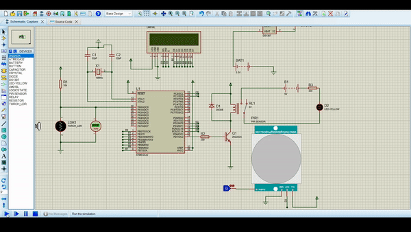
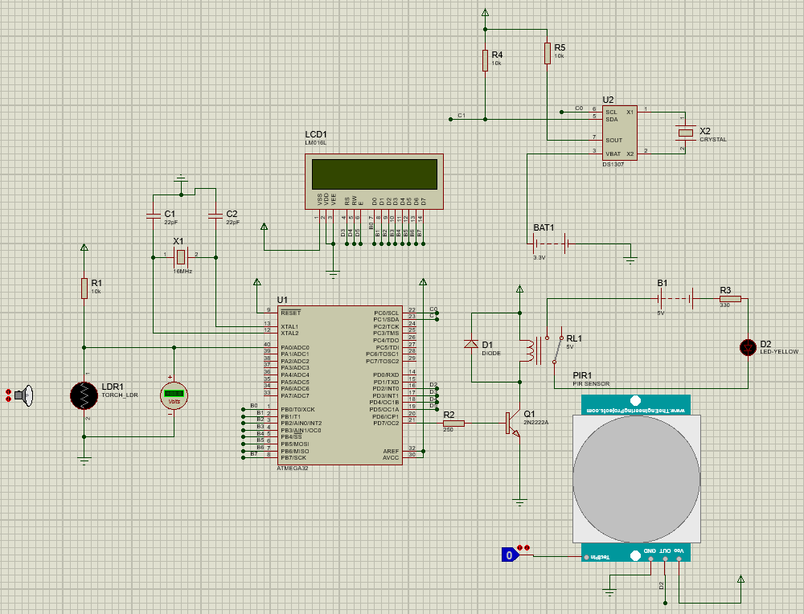
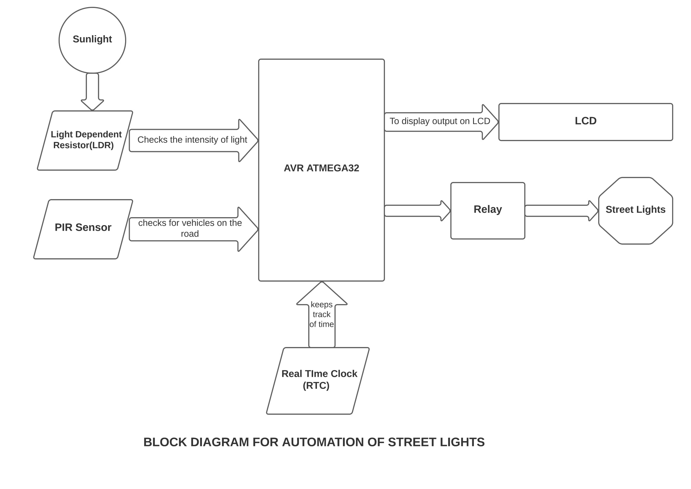

# Microcontroller-Based-Automatic-Intensity-Control-of-Street-Lights

The proposed system controls the street lights using light dependent sensor and PIR sensor.

- Street lights are switched on depending on the intensity of sunlight on LDR. If the intensity of sunlight on LDR is low, its resistance value is high. This value increases and becomes high when it is completely in dark. 
This resistance value decides when the street lights are required to switch ON. As the resistance value is maximum in the midnight, street lights turn themself ON with full intensity.
Another feature of this project is that street light's intensity vary according to vehicles on the road. RTC comes into the picture now. The controller checks peak time during which there is no traffic and keeps the lights switched OFF. 
When there is any vehicle on the road, it is detected by the PIR sensor. It just indicates the microcontroller to switch on the street lights. The lights are switched on for 2 to 3 minutes and switched off automatically. 

## Demo

## Schematic

## Block Diagram

## Run Locally

1. Make sure Proteus is installed in your system.  
2. Clone this Repo.  
3. Copy the 3 PIR library files from the PIR folder to the destination "C:\Program Files (x86)\Labcenter Electronics\Proteus 8 Professional\LIBRARY" on your system.  
4. Before running the simulation, double tap the PIR component and load the "PIRSensorTEP.hex" file in the program file option.  

## Working

- During day-time the intensity of street light is varied using LDR. 
- At night during peak hours(23hr to 07hr) the light is controlled using PIR sensor.When the PIR sensor detects any motion it switches on the light for a specific period of time
- Here just for demonstration purpose the led will light up for 2 seconds only. LED represents the street light.
- The LCD will display time only during peak hours(23hr to 07hr) at night.
- To check this circuit during day-time, set hr value of function rtc_set_t(hr,mm,ss) between 06 to 23 [means 7am to 11pm] (24 hrs format), which is there in the main function.
- To check this circuit during night, set hr value of function rtc_set_t(hr,mm,ss) between 22 to 07 [means 11pm to 7am] (24 hrs format)  which is there in the main function.

## Tech Stack

- Proteus
- WinAVR 

